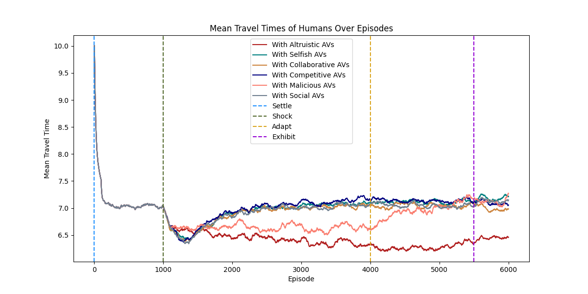
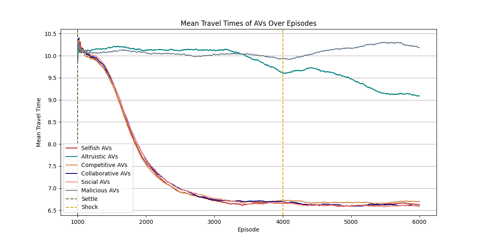

# Overview

This project involves the development of a reinforcement learning environment where AV and human agents learn the optimal path to get from an origin to a destination.
The implementation includes several components, as depicted in the UML Class and Sequence Diagrams [HERE](https://miro.com/app/board/uXjVN4vGqSI=/?share_link_id=316593087566).

# How to run on servers?

See [here](server_scripts/how_to.md).

   

# Training setting

## Number of agents
- 1200 agents
- Humans: 823 | AVs: 377 
- Humans: Gawron | AVs: DQN (Single)
## AVs' objective
- Conducted:
    - **Selfish**: Minimize own travel time.
    - **Altruistic**: Minimize everyone's travel times.
    - **Competitive**: Minimize own travel time, maximize other group's travel times.
    - **Collaborative**: Minimize own and own group's travel times. 
    - **Social**: Minimize own and everyone's travel times.
    - **Malicious**: Maximize other group's travel times.
- See [results](results).
## Training episodes
- 6000 episodes, 3 phases
- Phase 1 (**Settle**) : Starts in episode 1
    - Humans: 1200
    - Only humans learn.
- Phase 2 (**Shock**) : Starts in episode 1000
    - Humans: 823  AVs: 377 
    - Only machines learn.
- Phase 3 (**Adapt**) : Starts in episode 4000
    - Humans: 823  AVs: 377
    - Both machines and humans learn.
## Training duration
- 18 hours, 20 minutes, 16 seconds
- 11 seconds per episode in average
## Hardware
 - gpu=gpu:1
 - mem=64G
 - cpus-per-task=4
 - partition=dgx

   

# Results (All)
#### *Smoothed by n=200*
Human Travel Times            |  AV Travel Times
:-------------------------:|:-------------------------:
  |  

   

# Results (for Competitive AVs)

Compared to the traffic efficiencies in the end of settle and adapt phases:
- AVs achieved 8.779% travel time improvement,
    - (Before: 7.078 vs After: 6.456)
- At the cost of 0.072% human travel time change.
    - (Before: 7.078 vs After: 7.073)
- Overall traffic efficiency changed by 2.807%.
    - (Before: 7.078 vs After: 6.879)

#### *All plots smoothed by n=50*

## Travel times (in minutes)

## Distribution of Travel Times

## Collected Mean Rewards

## Mean Losses of DNNs of AVs 
#### (Throughout their learning)

## Simulation Timesteps

## Picked Actions for OD Pairs

## Action Selection Shifts After Mutation

## Freeflow Times
