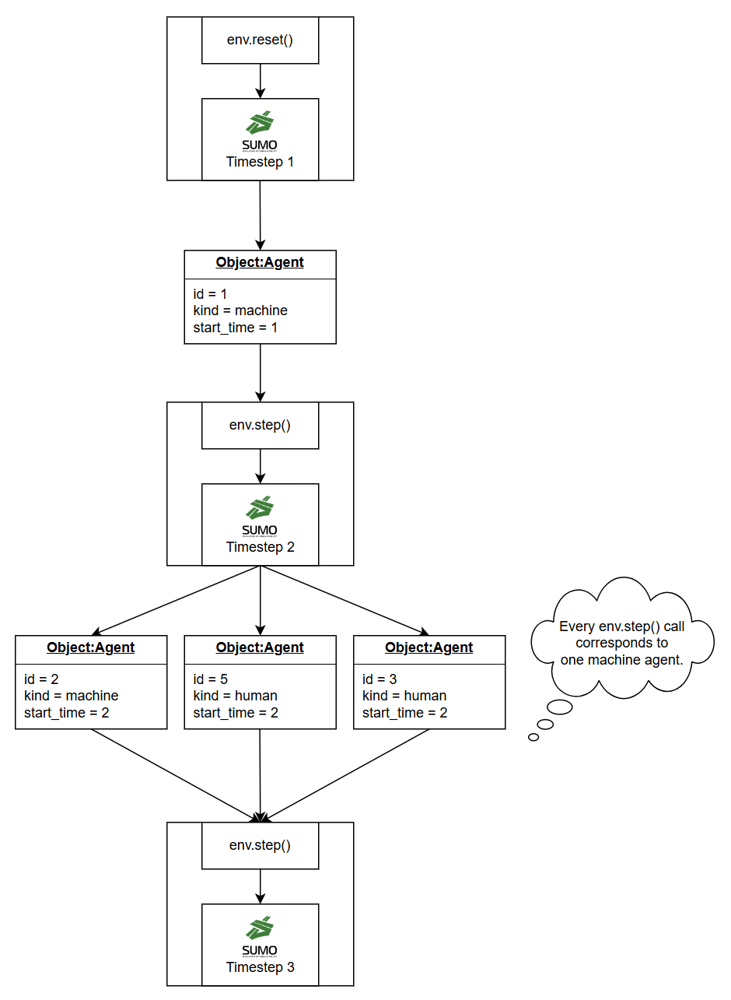
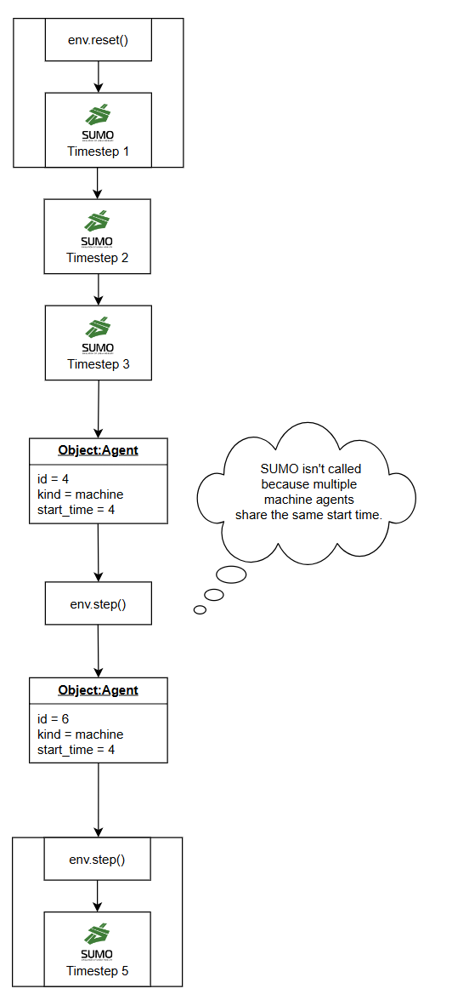
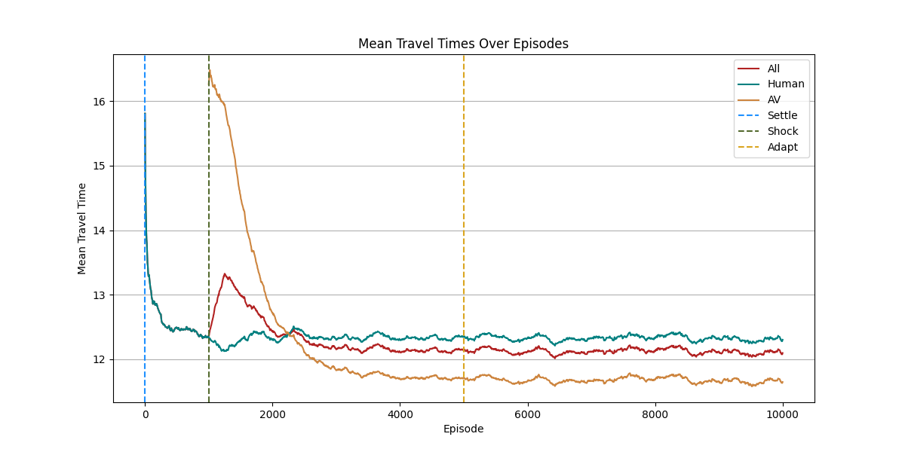
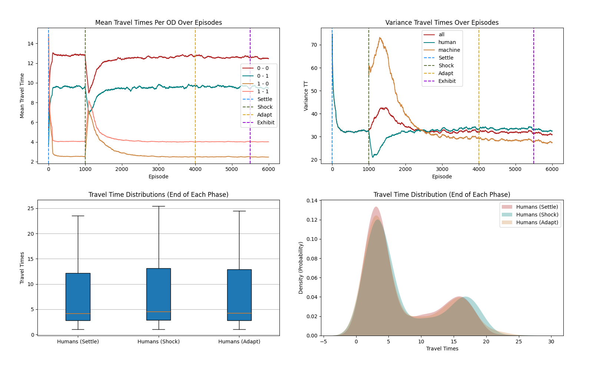
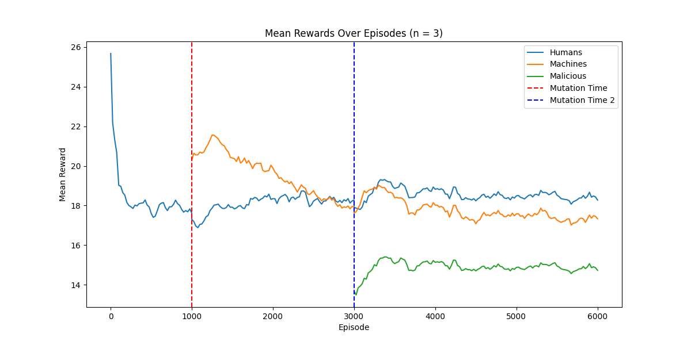
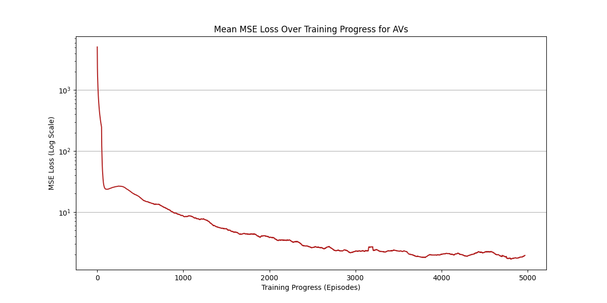
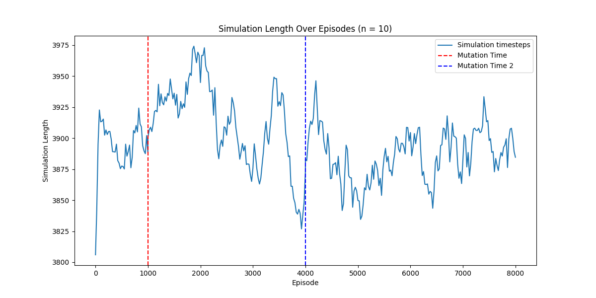
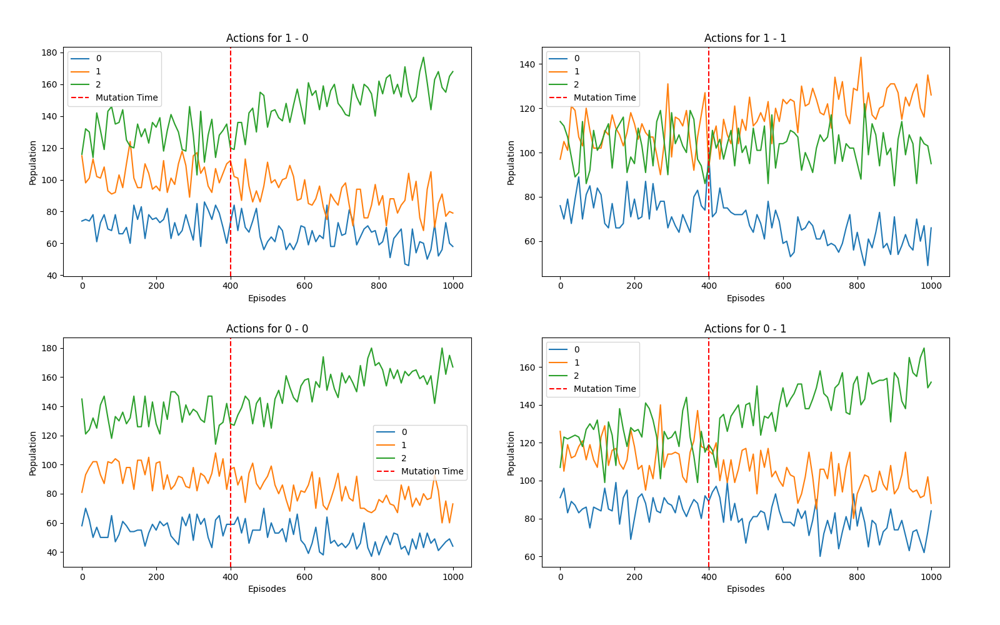
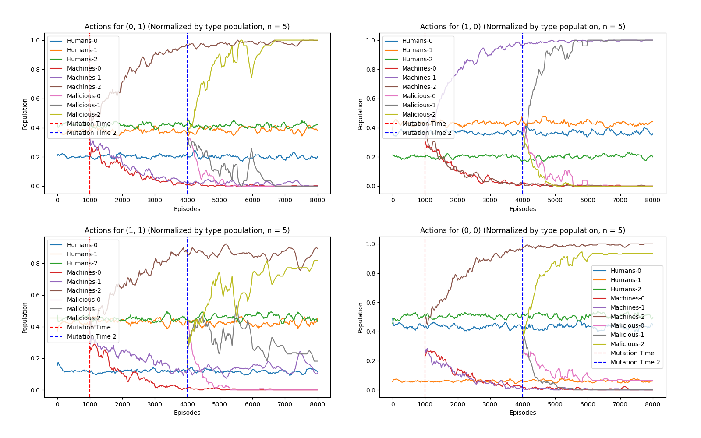

# How to run on servers?

See [here](server_scripts/how_to.md).

# PettingZoo environment

  
  

# Training setting

## Number of agents
- 1200 agents
- Humans: 823 | AVs: 377 
- Humans: Gawron | AVs: DQN (Single)
## AVs' objective
- **Competitive**: Minimize own travel time, maximize other group's travel times.
## Training episodes
- 10000 episodes, 3 phases
- Phase 1 (**Settle**) : Starts in episode 1
    - Humans: 1200
    - Only humans learn.
- Phase 2 (**Shock**) : Starts in episode 1000
    - Humans: 823  AVs: 377 
    - Only machines learn.
- Phase 3 (**Adapt**) : Starts in episode 5000
    - Humans: 823  AVs: 377
    - Both machines and humans learn.
## Training duration
- ~17 hours
- ~7 seconds per episode in average
## Hardware
 - gpu=gpu:1
 - mem=64G
 - cpus-per-task=4
 - partition=dgx

   

# Results
#### *All plots smoothed by n=50*

## Travel times (in minutes)

## Distribution of Travel Times

## Collected Mean Rewards

## Mean Losses of DNNs of AVs 
#### (Throughout their learning)

## Simulation Timesteps

## Picked Actions for OD Pairs

## Action Selection Shifts After Mutation

