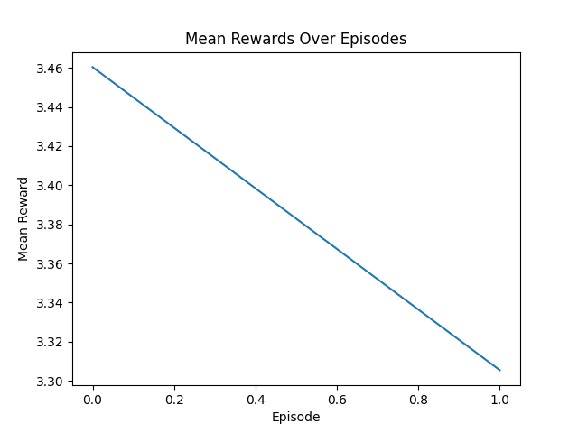
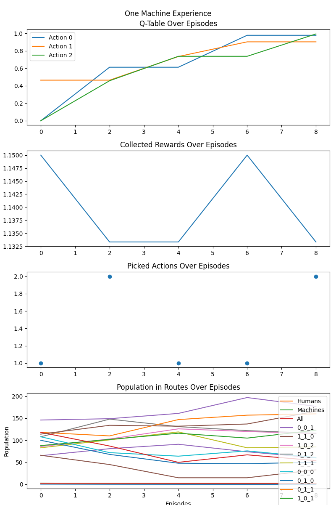
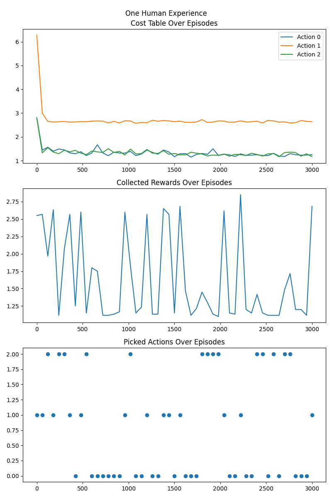
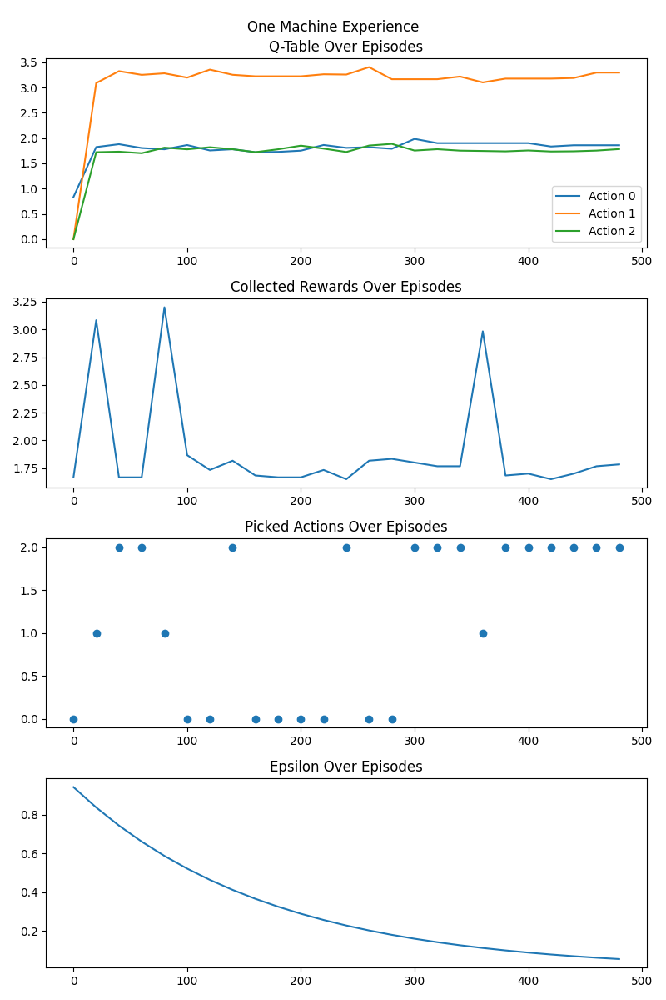

# Milestone 1

## Overview

This project involves the development of a reinforcement learning environment where machine and human agents learn the optimal path to get from an origin to a destination.
The implementation includes several components, as depicted in the UML Class and Sequence Diagrams [HERE](https://miro.com/app/board/uXjVN4vGqSI=/?share_link_id=316593087566).

## Collected Mean Rewards:

## Route Populations:

## One Random Human's Experience

## One Random Machine's Experience

