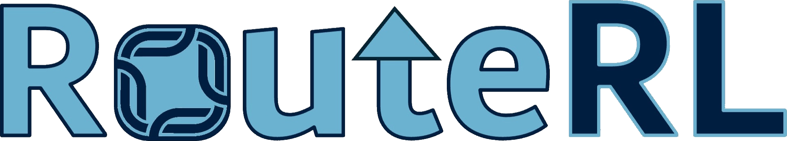
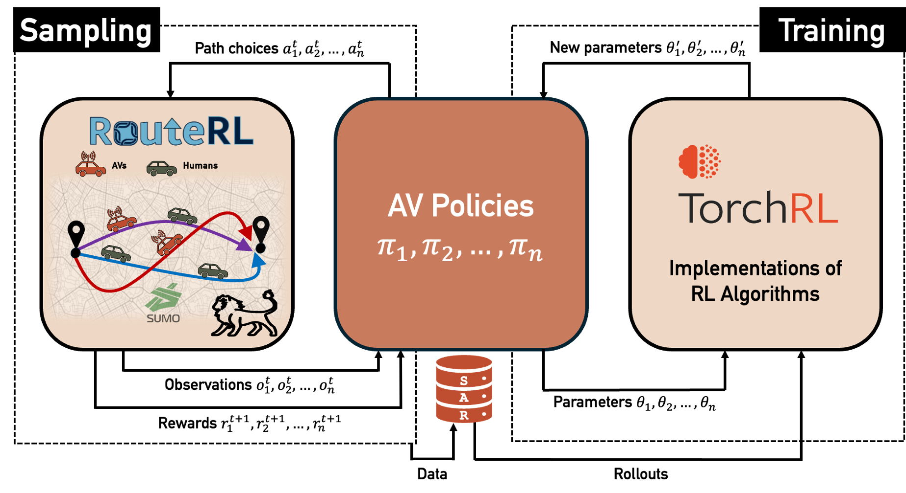
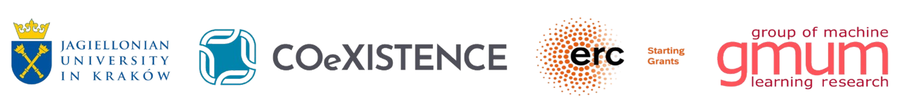

# RouteRL

> Multi-Agent Reinforcement Learning framework for modeling and simulating the collective route choices of humans and autonomous vehicles.

[](https://github.com/COeXISTENCE-PROJECT/RouteRL/actions/workflows/test_tutorials.yml)
[](https://coexistence-project.github.io/RouteRL/)
[](https://github.com/COeXISTENCE-PROJECT/RouteRL/blob/main/LICENSE.txt)
[](https://pypi.org/project/routerl/)
[](https://github.com/COeXISTENCE-PROJECT/RouteRL/actions/workflows/test_compatibility.yml)
[](https://codeocean.com/capsule/6105686/tree/v1)


<p align="center">
  
</p>

<br/>

<!-- start intro -->

RouteRL is a novel framework that integrates Multi-Agent Reinforcement Learning (MARL) with a microscopic traffic simulation, [SUMO](https://sumo.dlr.de/docs/index.html), facilitating the testing and development of efficient route choice strategies. The proposed framework simulates the daily route choices of driver agents in a city, including two types: 
- human drivers, emulated using discrete choice models,
- and AVs, modeled as MARL agents optimizing their policies for a predefined objective.

RouteRL aims to advance research in MARL, traffic assignment problems, social reinforcement learning (RL), and human-AI interaction for transportation applications. 

<!--RouteRL is a multi-agent reinforcement learning environment for urban route choice that simulates the coexistence of human drivers and Automated Vehicles (AVs) in city networks. 

- The main class is [TrafficEnvironment](https://github.com/COeXISTENCE-PROJECT/RouteRL/blob/main/routerl/environment/environment.py) and is a [PettingZoo](https://pettingzoo.farama.org/index.html) AEC API environment.
- There are two types of agents in the environment and are both represented by the [BaseAgent](https://github.com/COeXISTENCE-PROJECT/RouteRL/blob/3d2ca55e4474eee062f161c42f47a212b3936377/routerl/environment/agent.py#L14) class.
  - Human drivers are simulated using human route-choice behavior from transportation research.
  - Automated vehicles (AVs) are the RL agents that aim to optimize their routes and learn the most efficient paths.
- It is compatible with popular RL libraries such as [TorchRL](https://pytorch.org/rl/stable/tutorials/torchrl_demo.html). --!>

<!-- end intro -->

For overview see the [paper](https://arxiv.org/pdf/2502.20065) and for more details, check the documentation [online](https://coexistence-project.github.io/RouteRL/).


## RouteRL usage and functionalities at a glance
The following is a simplified code of a possible standard MARL algorithm implementation via TorchRL.

```python
env = TrafficEnvironment(seed=42, **env_params) # initialize the traffic environment

env.start() # start the connection with SUMO

for episode in range(human_learning_episodes): # human learning 
    env.step()

env.mutation() # some human agents transition to AV agents

collector = SyncDataCollector(env, policy, ...)  # collects experience by running the policy in the environment (TorchRL)

# training of the autonomous vehicles; human agents follow fixed decisions learned in their learning phase
for tensordict_data in collector:
        
    # update the policies of the learning agents
    for _ in range(num_epochs):
      subdata = replay_buffer.sample()
      loss_vals = loss_module(subdata)

      optimizer.step()
    collector.update_policy_weights_()

policy.eval() # set the policy into evaluation mode

# testing phase using the already trained policy
num_episodes = 100
for episode in range(num_episodes):
    env.rollout(len(env.machine_agents), policy=policy)
 
env.plot_results() # plot the results
env.stop_simulation() # stop the connection with SUMO
```


## Documentation


* [Tutorials](https://github.com/COeXISTENCE-PROJECT/RouteRL/tree/main/tutorials):
  * [Quickstart](https://github.com/COeXISTENCE-PROJECT/RouteRL/tree/main/tutorials/1_Quickstart_TraffficEnvironment_Introduction).
  * [Medium network and AVs behaviors](https://github.com/COeXISTENCE-PROJECT/RouteRL/tree/main/tutorials/2_MediumNetwork_AVsBehaviors_TorchRL_CollaborativeAlgorithms).
  * [Big network and independent AV agents](https://github.com/COeXISTENCE-PROJECT/RouteRL/tree/main/tutorials/3_BiggerNetwork_IndependentAgents).
  * [Large-scale network](https://github.com/COeXISTENCE-PROJECT/RouteRL/tree/main/tutorials/4_VeryBigNetwork).


## Installation

<!-- start installation -->

- **Prerequisite**: Make sure you have SUMO installed in your system. This procedure should be carried out separately, by following the instructions provided [here](https://sumo.dlr.de/docs/Installing/index.html).
- **Option 1**: Install the latest stable version from [PyPI](https://pypi.org/project/routerl/):  
  ```
    pip install routerl
  ```
- **Option 2**: Clone this repository for latest version, and manually install its dependencies: 
  ```
    git clone https://github.com/COeXISTENCE-PROJECT/RouteRL.git
    cd RouteRL
    pip install -r requirements.txt
  ```

## Reproducibility capsule
 
We have an experiment script encapsulated in a **CodeOcean** capsule. This capsule allows demonstrating RouteRL's capabilities **without the need for SUMO installation or dependency management**.
  1. Visit the [capsule link](https://codeocean.com/capsule/6105686/tree/v1).
  2. Create a free CodeOcean account (if you don’t have one).
  3. Click **Reproducible Run** to execute the code in a controlled and reproducible environment.
 
<!-- end installation -->

---
### Credits

`RouteRL` is part of [COeXISTENCE](https://www.rafalkucharskilab.pl/research/coexistence/) (ERC Starting Grant, grant agreement No 101075838) and is a team work at Jagiellonian University in Kraków, Poland by: [Ahmet Onur Akman](https://github.com/aonurakman) and [Anastasia Psarou](https://github.com/AnastasiaPsarou) (main contributors) supported by [Grzegorz Jamroz](https://github.com/GrzegorzJamroz), [Zoltán Varga](https://github.com/kistref), [Łukasz Gorczyca](https://github.com/Limexcyan), [Michał Hoffman](https://github.com/Crackhoff) and others, within the research group of [Rafał Kucharski](https://www.rafalkucharskilab.pl).

<p align="center">
  
</p>


