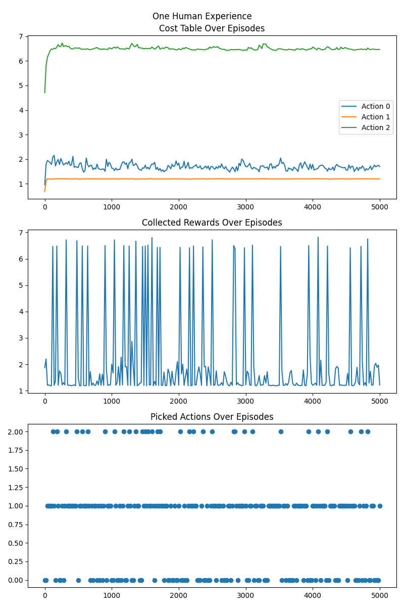
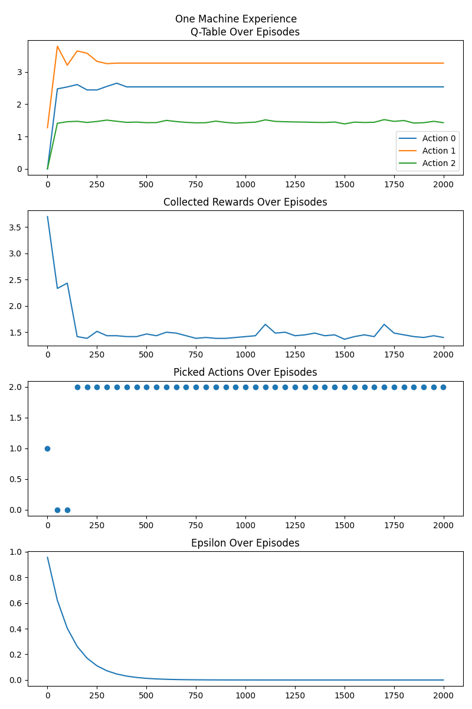

# Milestone 1

## Overview

This project involves the development of a reinforcement learning environment where machine and human agents learn the optimal path to get from an origin to a destination.
The implementation includes several components, as depicted in the UML Class and Sequence Diagrams [HERE](https://miro.com/app/board/uXjVN4vGqSI=/?share_link_id=316593087566).

## How to run on servers?

See [here](server_scripts/how_to.md).

## Training results

### Number of agents
1200 agents ~ around 600 machines and 600 humans (random)
### Training episodes
5000 Episodes
### Training duration
02 hours, 17 minutes, 04 seconds
### Visualizing agents
- Agent #159 from kind h with OD: 1-0 at start time 1768
- Agent #1071 from kind m with OD: 0-1 at start time 2394

## Collected Mean Rewards(in minutes):

## Simulation Timesteps:

## ID: 159

## ID:1071

## Route Populations:

## Freeflow Times

| Origin | Destination | Index | FF Time |
|--------|-------------|-------|---------|
|   0    |      0      |   0   |  2.084  |
|   0    |      0      |   1   |  1.977  |
|   0    |      0      |   2   |  3.325  |
|  ----  |     ----    |  ---- |   ----  |
|   0    |      1      |   0   |  0.779  |
|   0    |      1      |   1   |  1.118  |
|   0    |      1      |   2   |  0.768  |
|  ----  |     ----    |  ---- |   ----  |
|   1    |      0      |   0   |  0.740  |
|   1    |      0      |   1   |  0.687  |
|   1    |      0      |   2   |  4.705  |
|  ----  |     ----    |  ---- |   ----  |
|   1    |      1      |   0   |  2.035  |
|   1    |      1      |   1   |  3.847  |
|   1    |      1      |   2   |  2.232  |
|  ----  |     ----    |  ---- |   ----  |
