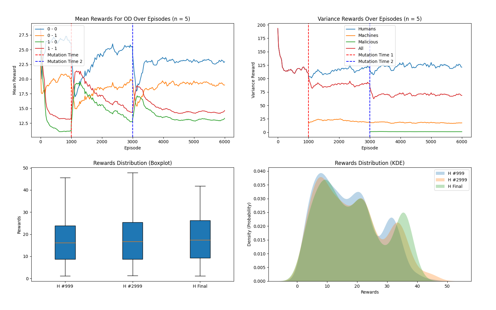
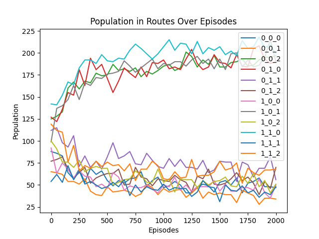
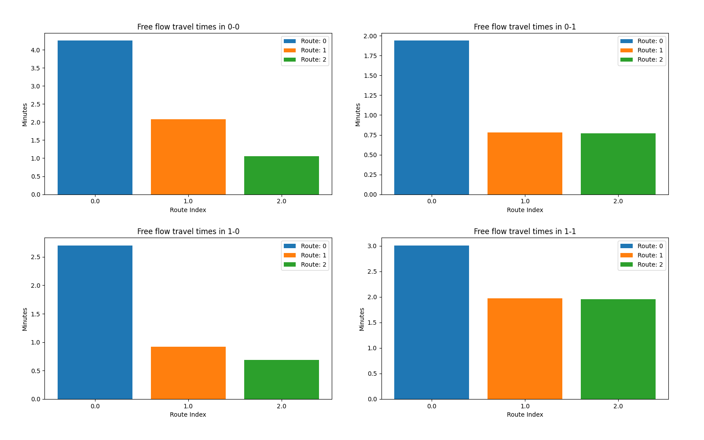

# Milestone 1

## Overview

This project involves the development of a reinforcement learning environment where machine and human agents learn the optimal path to get from an origin to a destination.
The implementation includes several components, as depicted in the UML Class and Sequence Diagrams [HERE](https://miro.com/app/board/uXjVN4vGqSI=/?share_link_id=316593087566).

## How to run on servers?

See [here](server_scripts/how_to.md).

## Training results

### Number of agents
1000 agents ~ around 80% humans and 20% mutating humans
### Training episodes
5000 Episodes, mutation at 1000
### Training duration
10 hours, 03 minutes, 53 seconds
### Specs
mem: 64G, cpus-per-task: 20, partition: cpu

## Collected Mean Rewards(in minutes):

## Distribution of Rewards:

## Simulation Timesteps:

## Picked Actions for OD Pairs

## Action Selection Shifts After Mutation

## Route Populations:

## Freeflow Times
