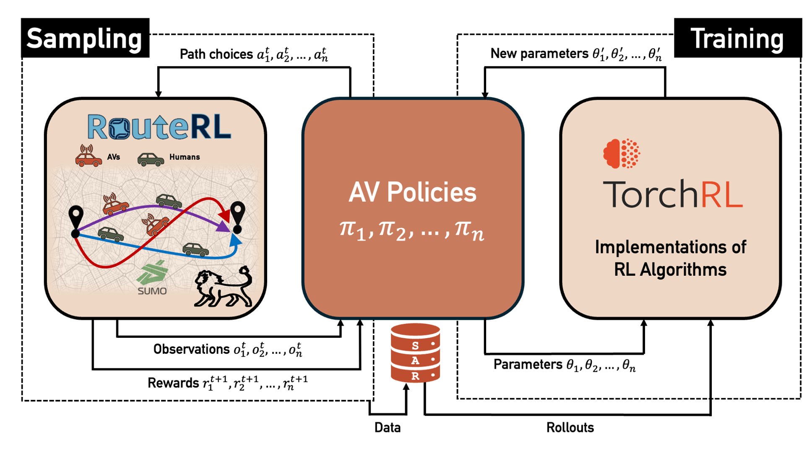

# RouteRL

[](https://github.com/COeXISTENCE-PROJECT/RouteRL/tree/main/notebooks)
[](https://coexistence-project.github.io/RouteRL/)
[](https://github.com/COeXISTENCE-PROJECT/RouteRL/blob/main/LICENSE.txt)


<br/>

<!-- start intro -->

RouteRL is a novel framework that integrates MARL with a microscopic traffic simulation, [SUMO](https://sumo.dlr.de/docs/index.html), facilitating the testing and development of efficient route choice strategies. The proposed framework simulates the daily route choices of driver agents in a city, including two types: 
- human drivers, emulated using discrete choice models,
- and AVs, modeled as MARL agents optimizing their policies for a predefined objective.

RouteRL aims to advance research in MARL, traffic assignment problems, social reinforcement learning (RL), and human-AI interaction for transportation applications. 

<!--RouteRL is a multi-agent reinforcement learning environment for urban route choice that simulates the coexistence of human drivers and Automated Vehicles (AVs) in city networks. 

- The main class is [TrafficEnvironment](https://github.com/COeXISTENCE-PROJECT/RouteRL/blob/main/routerl/environment/environment.py) and is a [PettingZoo](https://pettingzoo.farama.org/index.html) AEC API environment.
- There are two types of agents in the environment and are both represented by the [BaseAgent](https://github.com/COeXISTENCE-PROJECT/RouteRL/blob/3d2ca55e4474eee062f161c42f47a212b3936377/routerl/environment/agent.py#L14) class.
  - Human drivers are simulated using human route-choice behavior from transportation research.
  - Automated vehicles (AVs) are the RL agents that aim to optimize their routes and learn the most efficient paths.
- It is compatible with popular RL libraries such as [TorchRL](https://pytorch.org/rl/stable/tutorials/torchrl_demo.html). --!>

<!-- end intro -->

For more details, check the documentation [online](https://coexistence-project.github.io/RouteRL/).

## RouteRL usage and functionalities at glance

```python
env = TrafficEnvironment(seed=42, **env_params) # initialize the traffic environment

env.start() # start the connection with SUMO

for episode in range(human_learning_episodes): # human learning 
    env.step()

env.mutation() # some human agents transition to AV agents

collector = SyncDataCollector(env, policy, ...)  # collects experience by running the policy in the environment (TorchRL)

# training of the autonomous vehicles; human agents follow fixed decisions learned in their training phase
for tensordict_data in enumerate(collector):
        
    # update the policies of the learning agents
    for _ in range(num_epochs):
      subdata = replay_buffer.sample()
      loss_vals = loss_module(subdata)

      optimizer.step()
    collector.update_policy_weights_()

policy.eval() # set the policy into evaluation mode

# testing phase using the already trained policy
num_episodes = 100
for episode in range(num_episodes):
    env.rollout(len(env.machine_agents), policy=qnet_explore)
 
env.plot_results() # plot the results
env.stop_simulation() # stop the connection with SUMO
```


## Documentation


* [Tutorials](https://github.com/COeXISTENCE-PROJECT/RouteRL/tree/main/tutorials):
  * [Quickstart](https://github.com/COeXISTENCE-PROJECT/RouteRL/tree/main/tutorials/1_Quickstart_TraffficEnvironment_Introduction).
  * [Medium network and AVs behaviors](https://github.com/COeXISTENCE-PROJECT/RouteRL/tree/main/tutorials/2_MediumNetwork_AVsBehaviors_TorchRL_CollaborativeAlgorithms).
  * [Big network and independent AV agents](https://github.com/COeXISTENCE-PROJECT/RouteRL/tree/main/tutorials/3_BiggerNetwork_IndependentAgents).
  * [Large-scale network](https://github.com/COeXISTENCE-PROJECT/RouteRL/tree/main/tutorials/4_VeryBigNetwork).


## Installation

<!-- start installation -->

- **Prerequisite**: Make sure you have SUMO installed in your system. This procedure should be carried out separately, by following the instructions provided [here](https://sumo.dlr.de/docs/Installing/index.html).
- **Option 1**: Install the latest stable version from PyPI:  
  ```
    pip install routerl
  ```
- **Option 2**: Clone this repository for latest version, and manually install its dependencies: 
  ```
    git clone https://github.com/COeXISTENCE-PROJECT/RouteRL.git
    cd RouteRL
    pip install -r requirements.txt
  ```

- **Option 3**: Go to [RouteRL capsule](https://codeocean.com/capsule/) on codeocean website 
and click *Reproducible Run*.
 
<!-- end installation -->  


