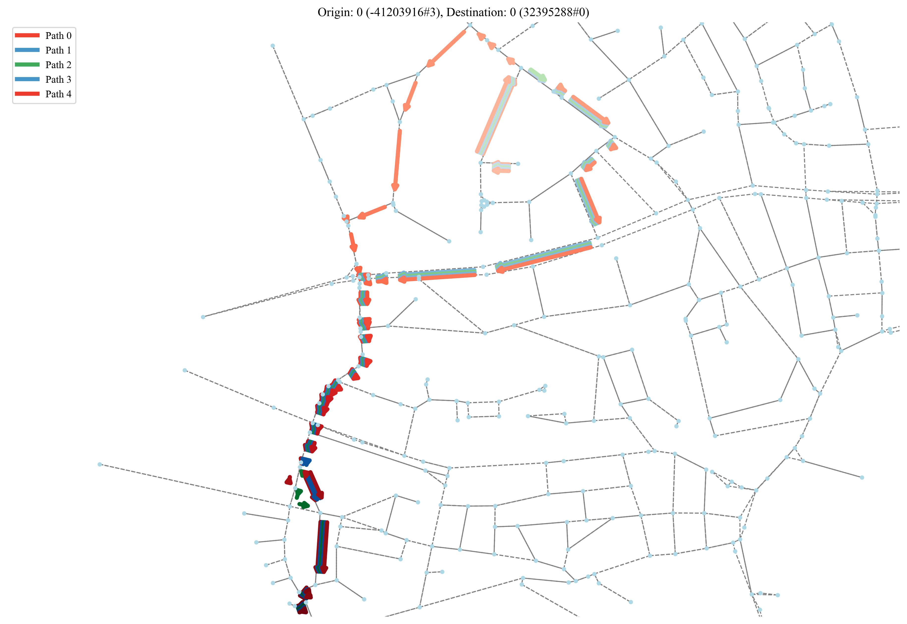
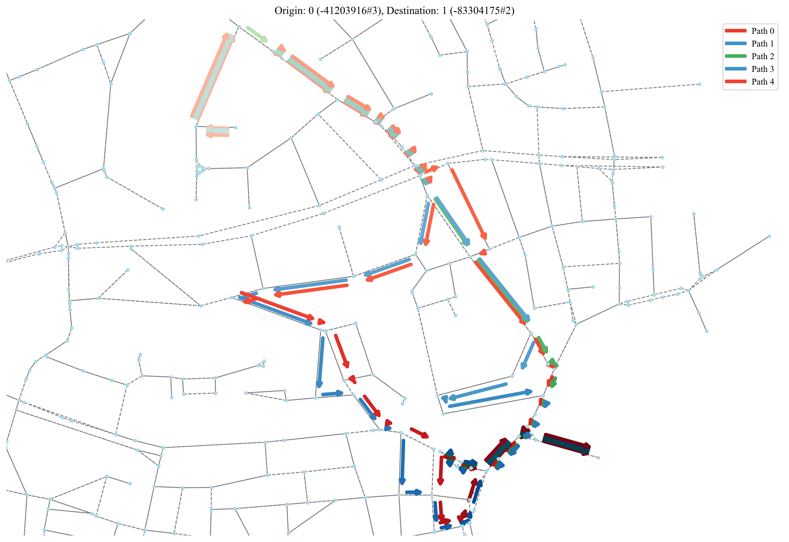
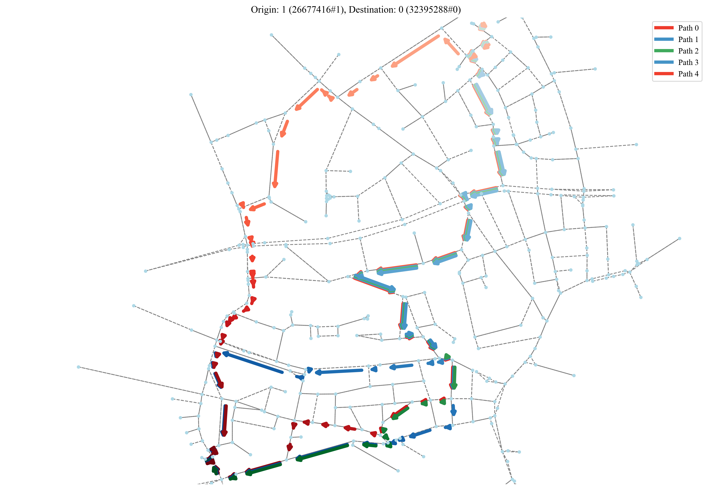
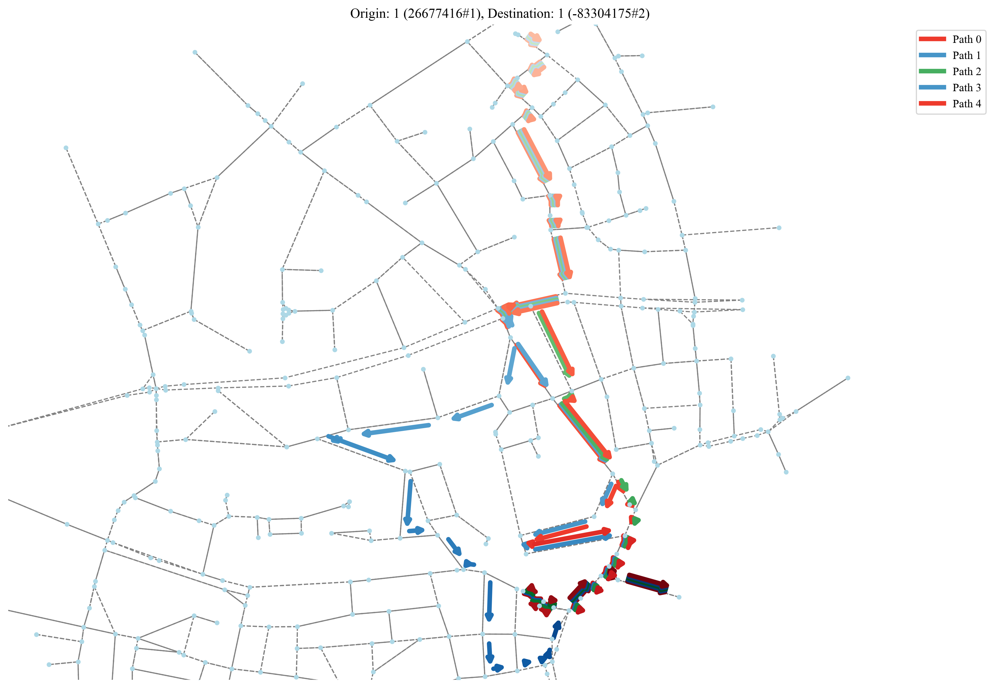

# Actions

The action space includes discrete route options, generated with dedicated path generator [JanuX](https://github.com/COeXISTENCE-PROJECT/JanuX) to connect specific origin and destination points.

Example of the 5 available routes generated for the [Ingolstadt](https://github.com/COeXISTENCE-PROJECT/RouteRL/blob/main/tutorials/3_BiggerNetwork_IndependentAgents/README.md) network.

    <figure style="width: 48%;">
        
        <figcaption style="text-align: center;">Routes connecting origin-destination 0-0 points</figcaption>
    </figure>
    <figure style="width: 48%;">
        
        <figcaption style="text-align: center;">Routes connecting origin-destination 0-1 points</figcaption>
    </figure>

 

    <figure style="width: 48%;">
        
        <figcaption style="text-align: center;">Routes connecting origin-destination 1-0 points</figcaption>
    </figure>
    <figure style="width: 48%;">
        
        <figcaption style="text-align: center;">Routes connecting origin-destination 1-1 points</figcaption>
    </figure>

