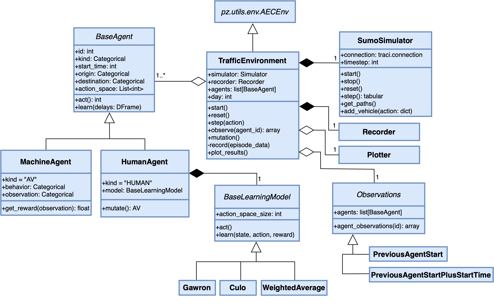
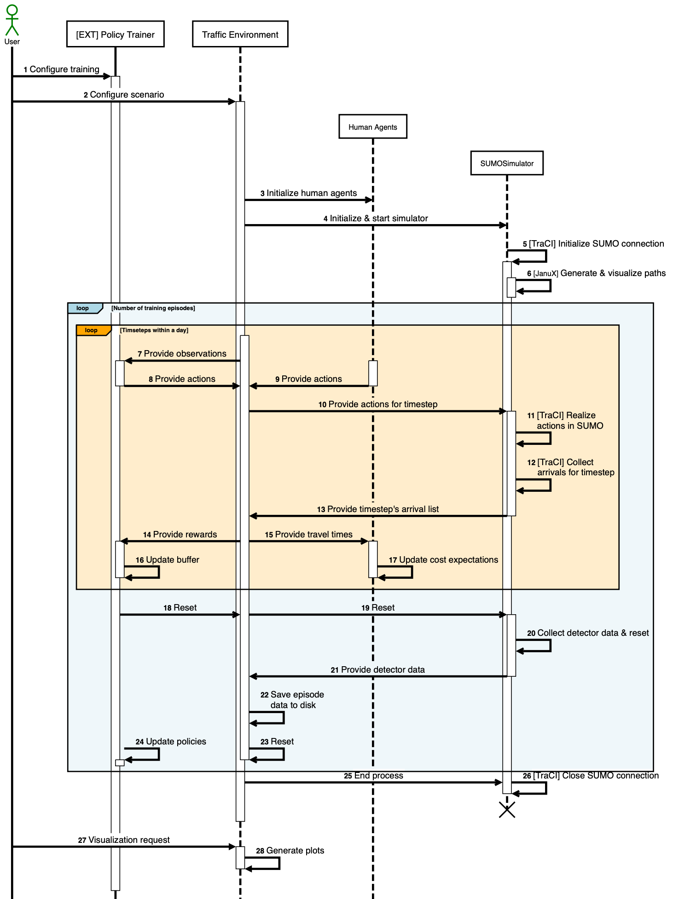

# Diagrams

## UML Class Diagram

A high-level UML class diagram visualizing the class hierarchy within RouteRL. Inessential attributes and methods are omitted.

---

## UML Sequence Diagram

A UML sequence diagram depicting the user's interaction with different elements of RouteRL. External dependencies are provided in square brackets. Some intermediate steps and inessential modules are abstracted for clarity. Multiple instances (like a group of agents) are summarized into one participant.