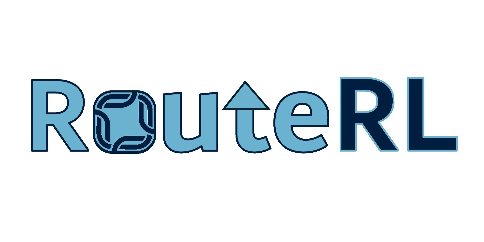

# RouteRL

## Documentation

- [PZ Environment](documentation/pz_env.md)
- [Simulator](documentation/simulator.md)
- [Machine Agents](documentation/machine_agents.md)
- [Human Agents](documentation/human_agents.md)
- [Observations](documentation/observations.md)

## Development

Check the repository [here](https://github.com/COeXISTENCE-PROJECT/Milestone-One).
