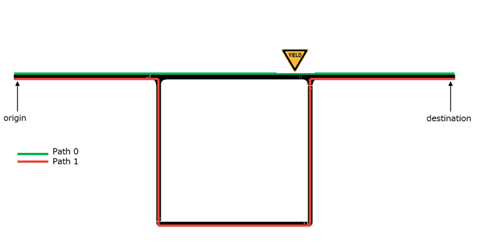

# Networks

    <figure style="width: 48%;">
        
        <figcaption>Ingolstadt Network</figcaption>
    </figure>
    <figure style="width: 48%;">
        
        <figcaption>Cologne Network</figcaption>
    </figure>

    <figure style="width: 48%;">
        
        <figcaption>Csomor Network</figcaption>
    </figure>
    <figure style="width: 48%;">
        
        <figcaption>Two Route Network</figcaption>
    </figure>

    <figure style="width: 48%;">
        
        <figcaption>Arterial Network</figcaption>
    </figure>
    <figure style="width: 48%;">
        
        <figcaption>Grid Network</figcaption>
    </figure>

