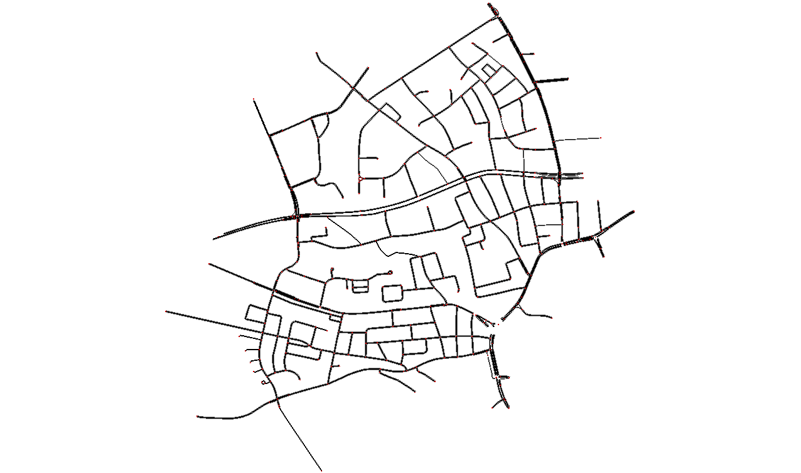
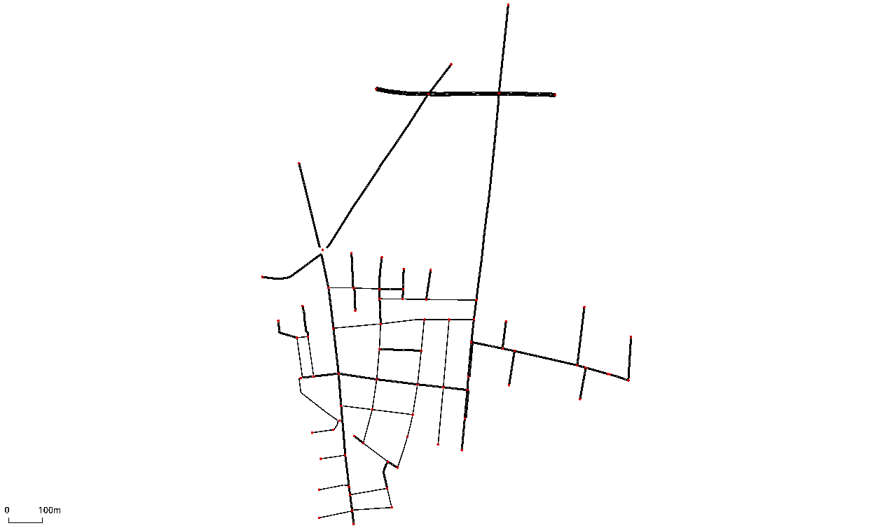

# Networks

```{figure} ../_static/cologne.png
   :alt: RouteRL
```

<div style="display: flex; justify-content: space-between;">
    
    
</div>

<p align="center">
    
    
</p>
<p align="center">
    
    
</p>
<p align="center">
    
    
</p>
<p align="center">
    
    
</p>
