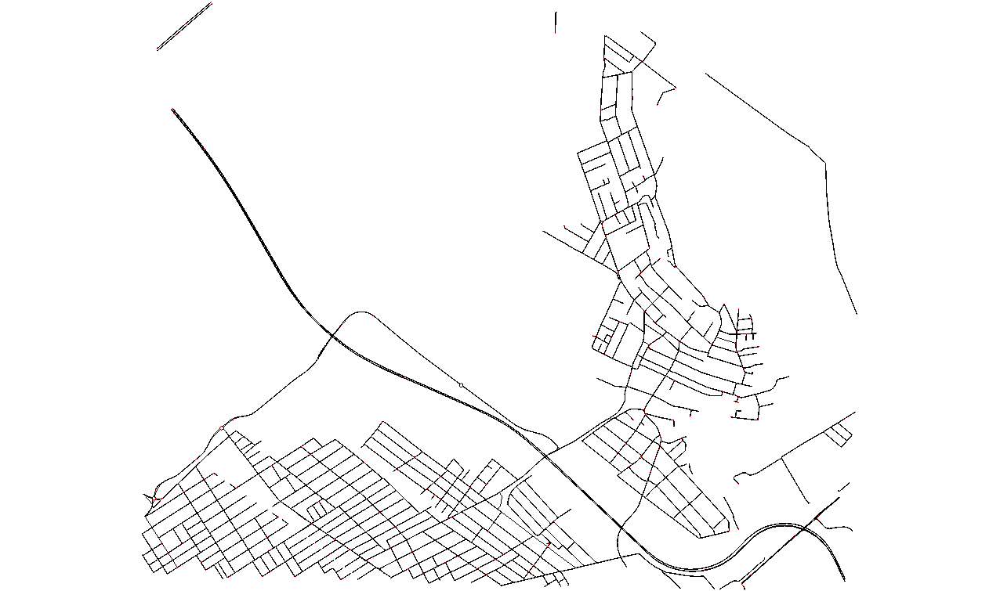
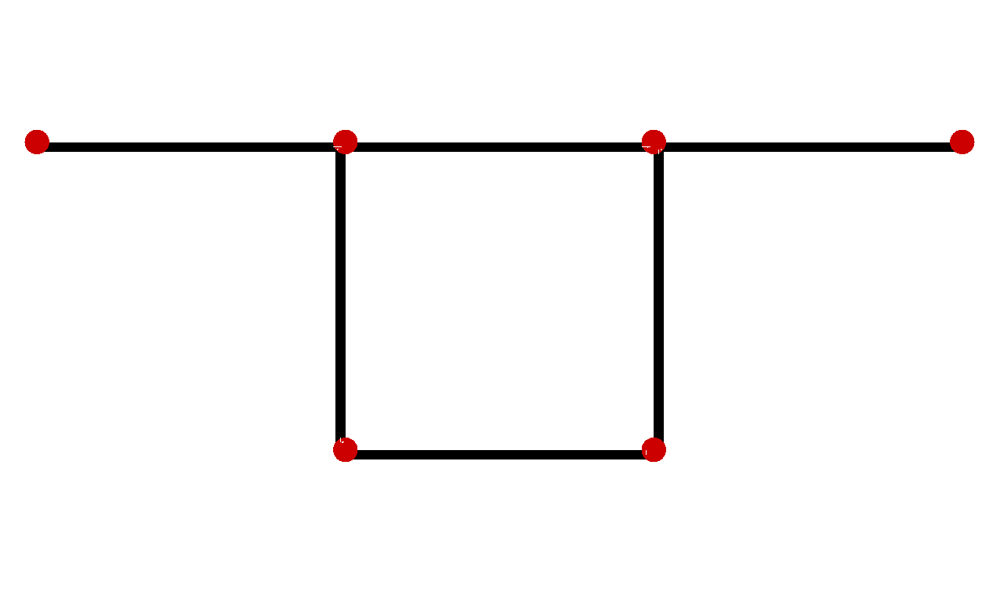
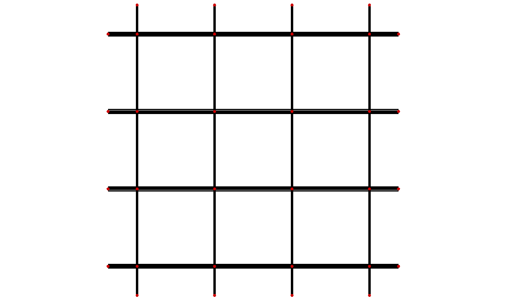
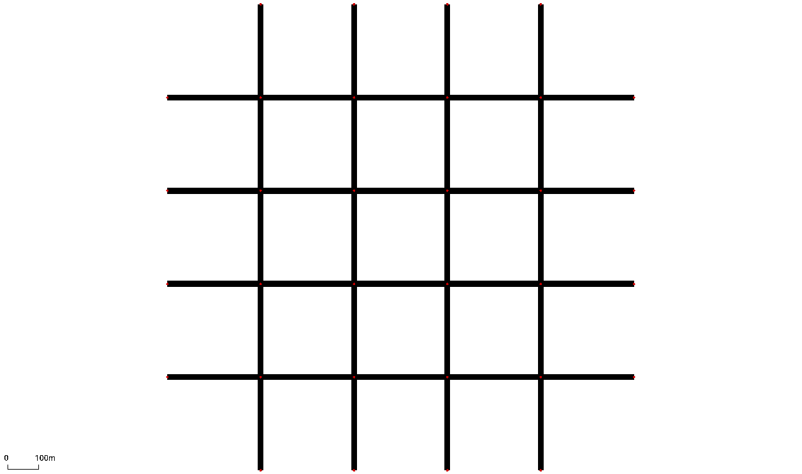
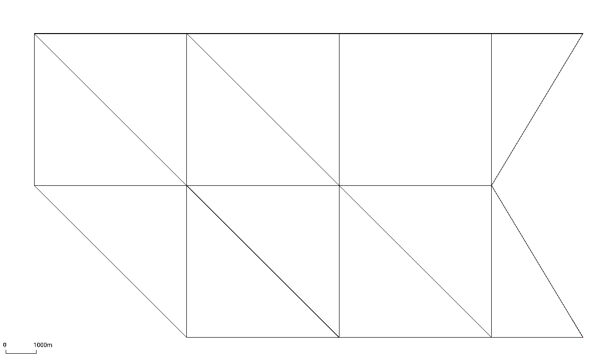
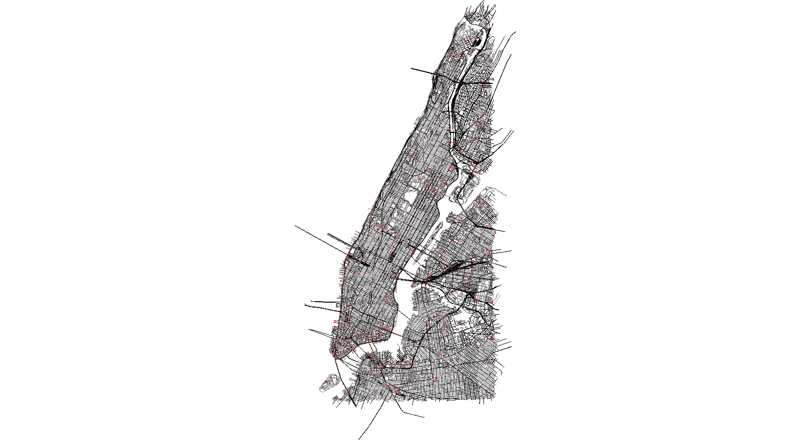
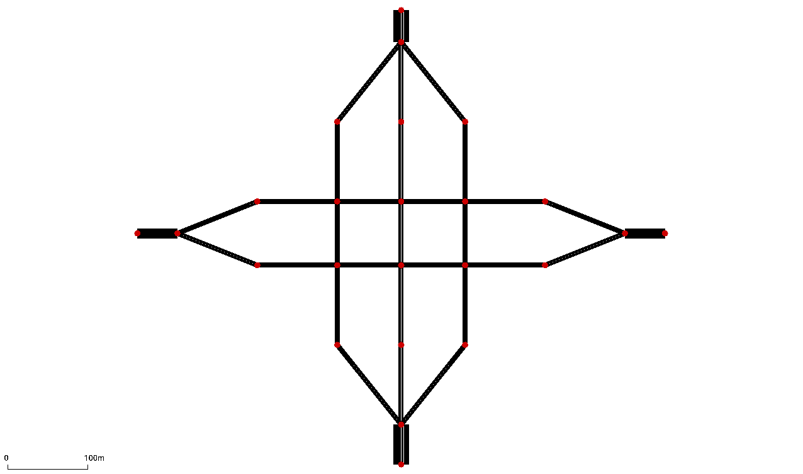

# Networks

    <figure style="width: 48%;">
        
        <figcaption style="text-align: center;">Ingolstadt Network</figcaption>
    </figure>
    <figure style="width: 48%;">
        
        <figcaption style="text-align: center;">Cologne Network</figcaption>
    </figure>

    <figure style="width: 48%;">
        
        <figcaption style="text-align: center;">Csomor Network</figcaption>
    </figure>
    <figure style="width: 48%;">
        
        <figcaption style="text-align: center;">Two Route Network</figcaption>
    </figure>

    <figure style="width: 48%;">
        
        <figcaption style="text-align: center;">Arterial Network</figcaption>
    </figure>
    <figure style="width: 48%;">
        
        <figcaption style="text-align: center;">Grid Network</figcaption>
    </figure>

    <figure style="width: 48%;">
        
        <figcaption style="text-align: center;">Arterial Network</figcaption>
    </figure>
    <figure style="width: 48%;">
        
        <figcaption style="text-align: center;">Grid Network</figcaption>
    </figure>

    <figure style="width: 48%;">
        
        <figcaption style="text-align: center;">Arterial Network</figcaption>
    </figure>
    <figure style="width: 48%;">
        
        <figcaption style="text-align: center;">Grid Network</figcaption>
    </figure>

