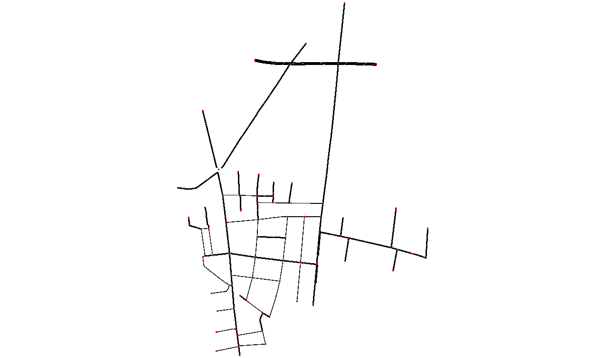
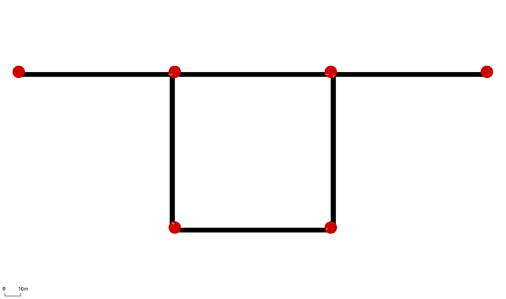
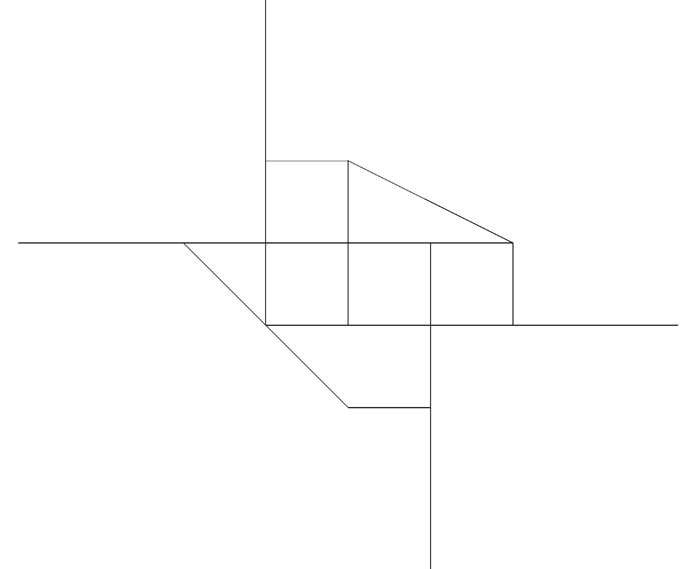
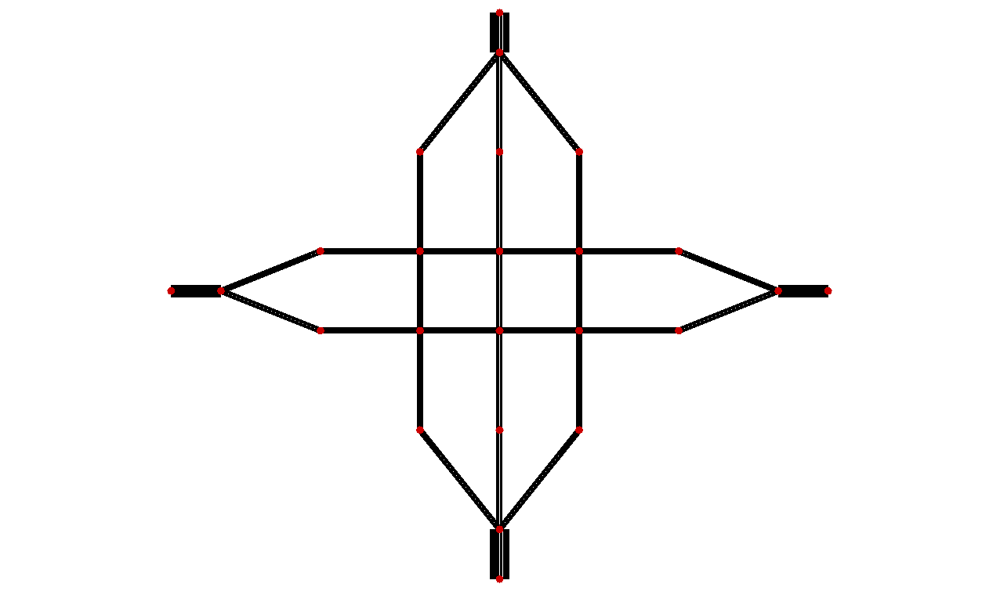

# Networks

Some of the networks utilized in this study include **Ingolstadt**, **Cologne**, **Csomor**, and **Manhattan**, each representing different traffic scenarios for evaluating the impact of autonomous vehicles (AVs) on urban mobility.

For a detailed definition of the network names and their corresponding keychain:  
[**Network Keychain**](https://github.com/COeXISTENCE-PROJECT/RouteRL/blob/9c02a6eca4df0900460ab44d4029a77eeb10e5ff/routerl/keychain.py#L121C5-L121C135).

    <figure style="width: 48%;">
        
        <figcaption style="text-align: center;">Ingolstadt Network</figcaption>
    </figure>
    <figure style="width: 48%;">
        
        <figcaption style="text-align: center;">Cologne Network</figcaption>
    </figure>

 
 

    <figure style="width: 48%;">
        
        <figcaption style="text-align: center;">Csomor Network</figcaption>
    </figure>
    <figure style="width: 48%;">
        
        <figcaption style="text-align: center;">Two Route Network</figcaption>
    </figure>

 
 

    <figure style="width: 48%;">
        
        <figcaption style="text-align: center;">Arterial Network</figcaption>
    </figure>
    <figure style="width: 48%;">
        
        <figcaption style="text-align: center;">Grid Network</figcaption>
    </figure>

 
 

    <figure style="width: 48%;">
        
        <figcaption style="text-align: center;">Ortuzar Network</figcaption>
    </figure>
    <figure style="width: 48%;">
        
        <figcaption style="text-align: center;">Manhattan Network</figcaption>
    </figure>

 
 

    <figure style="width: 48%;">
        
        <figcaption style="text-align: center;">Nguyen Network</figcaption>
    </figure>
    <figure style="width: 48%;">
        
        <figcaption style="text-align: center;">Grid 6 Network</figcaption>
    </figure>

# Demand

The [`agent_generation.py`](https://github.com/COeXISTENCE-PROJECT/RouteRL/blob/main/routerl/environment/agent_generation.py) file defines the network demand for each experiment by specifying the number of agents, their origins, destinations, and start times.