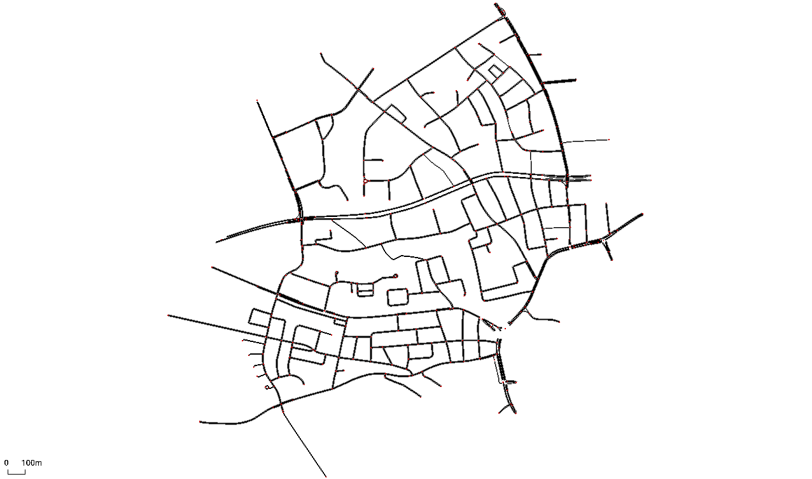

# Large-Sized Network: Independent AV agents

> In this tutorial, we use a large network for agent navigation. The chosen origin and destination points are specified in this [file](https://github.com/COeXISTENCE-PROJECT/RouteRL/blob/main/routerl/networks/default_ods.json) and can be adjusted by users. We implement the learning process of the automated vehicles (AVs) using the [TorchRL](https://github.com/pytorch/rl) library.

---

## Network Overview

> In these notebooks, we utilize the **Ingolstadt network** within our simulator, [SUMO](https://eclipse.dev/sumo/). Since agents exhibit **selfish behavior**, we employ **independent learning algorithms** to model their decision-making.

> Users can customize `TrafficEnvironment` by consulting its current [`defaults.json`](https://github.com/COeXISTENCE-PROJECT/RouteRL/blob/main/routerl/environment/defaults.json), overriding the desired values in a dictionary, and passing that dictionary to the class.

### Included Tutorials:

- **[IQL Tutorial.](https://github.com/COeXISTENCE-PROJECT/RouteRL/blob/main/tutorials/3_BiggerNetwork_IndependentAgents/iql_mutation.ipynb)** Uses **Independent Q-Learning (IQL)** ([IQL](https://web.media.mit.edu/~cynthiab/Readings/tan-MAS-reinfLearn.pdf)) as an initial baseline for training decentralized policies.

- **[IPPO Tutorial.](https://github.com/COeXISTENCE-PROJECT/RouteRL/blob/main/tutorials/3_BiggerNetwork_IndependentAgents/ippo_mutation.ipynb)** Implements **Independent Proximal Policy Optimization (IPPO)** ([IPPO](https://arxiv.org/pdf/2011.09533)), which has demonstrated strong benchmark performance in various tasks ([paper1](https://arxiv.org/abs/2103.01955), [paper2](https://arxiv.org/abs/2006.07869)).

- **[ISAC Tutorial.](https://github.com/COeXISTENCE-PROJECT/RouteRL/blob/main/tutorials/3_BiggerNetwork_IndependentAgents/isac_mutation.ipynb)** Uses **Independent SAC (ISAC)**, the multi-agent extension of **Soft Actor-Critic (SAC)** ([SAC](https://arxiv.org/abs/1801.01290)), which balances exploration and exploitation using entropy-regularized reinforcement learning.

---

### Ingolstadt Network Visualization

  

