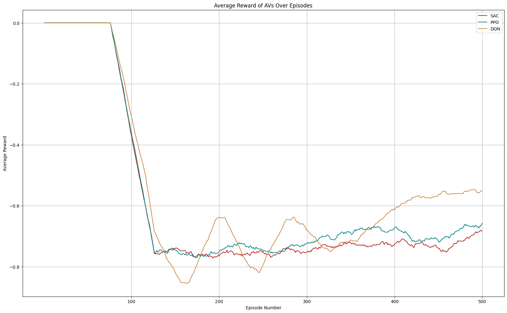
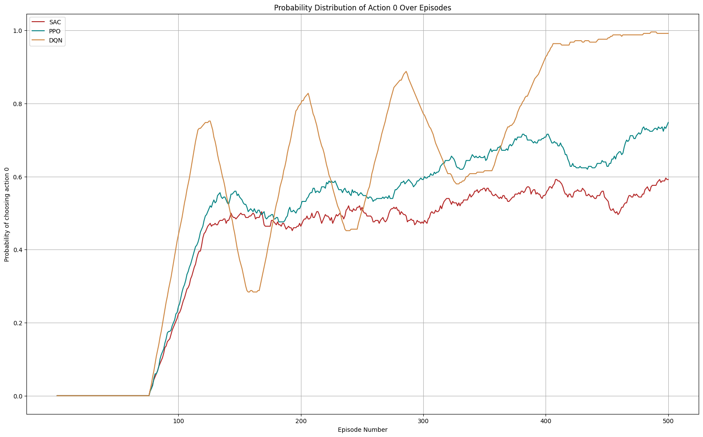
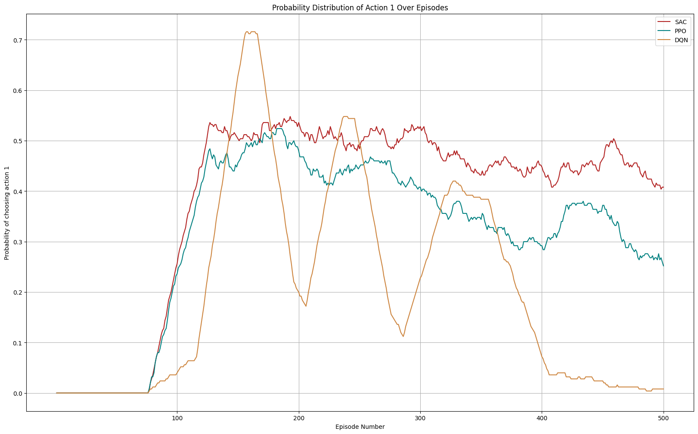

# Two route experiment

In this folder we experiment on a two route network.

## Training setting
---

### Number of agents
---
- 10 agents
- Human: 5 | AVs: 5
- Humans: Gawron | AVs: PPO, DQN, SAC

### Training episodes
---
- 500 episodes, 2 phases
- Phase 1: Starts in episode 1
    - Humans 10 (learn)
- Phase 2: Start in episode 100
    - Humans: 5 (don't learn) | AVs: 5 (learn)
 
### Training duration
---
- PPO: 02:06:09 (gpu)
- DQN: 00:39:15 (gpu)
- SAC: 03:34:15 (cpu)

### Hardware
---
- gpu=gpu1
- mem=64GB
- partition=dgx

### Results
---
**All plots smoothed by n=50.**

#### Average reward comparison betweeen AVs

#### Probability distributions of action 0 over episodes

#### Probability distributions of action 1 over episodes

