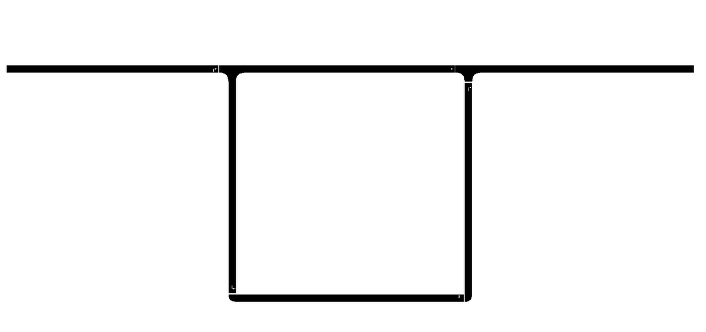
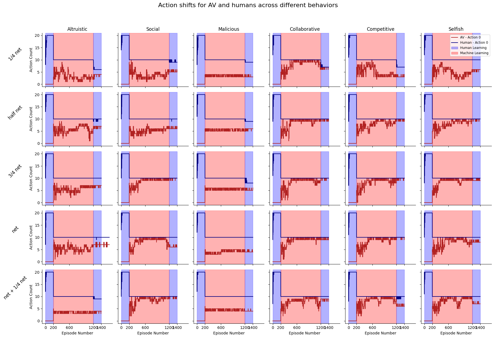
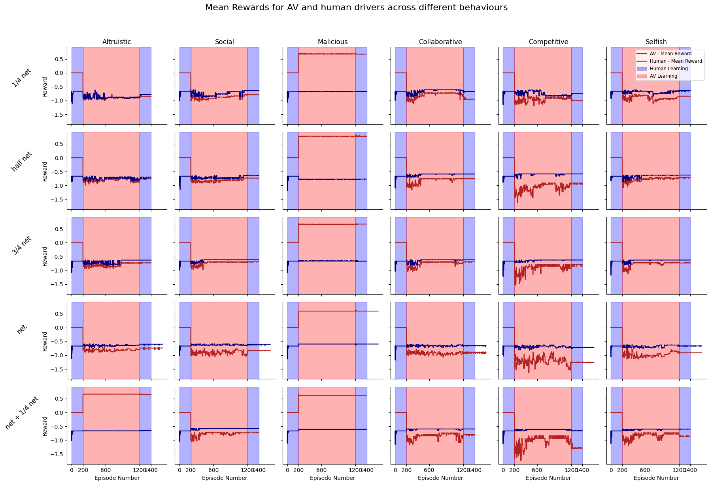

# Two route experiment

In this folder we experiment on a two route network.

## Training setting
---

### Number of agents
---
- 20 agents
- Human: 10 | AVs: 10
- Humans: Gawron | AVs: DQN

### Behaviors of AV agents
---
- **Selfish**: Optimize for their own travel time (TT).
- **Competitive**: Seek to maximize twice their own TT, minus the human agents' TT.
- **Collaborative**: Aim to maximize a combination of half their own TT and the collective AVs' TT.
- **Social**: Strive to optimize half their own TT in addition to the total TT of all vehicles.
- **Altruistic**: Prioritize minimizing the overall TT for all vehicles.
- **Malicious**: Intentionally minimize the AVs' TT.

### Training episodes
---
1400 episodes, 3 phases
- **Phase 1**: Starts in episode 1
    - Humans 20 (learn)
- **Phase 2**: Starts in episode 200
    - Humans: 10 (don't learn) | AVs: 10 (learn)
- **Phase 3**: Starts in episode 1200
    - Humans: 10 (learn) | AVs: 10 (don't learn)
 
### Training duration
---
- DQN: 6-7h (gpu)

### Hardware
---
- gpu=gpu1
- mem=64GB
- partition=dgx

### Results
---

---

