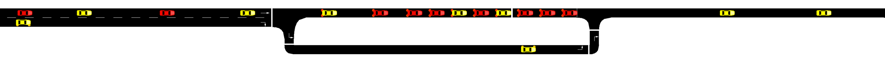
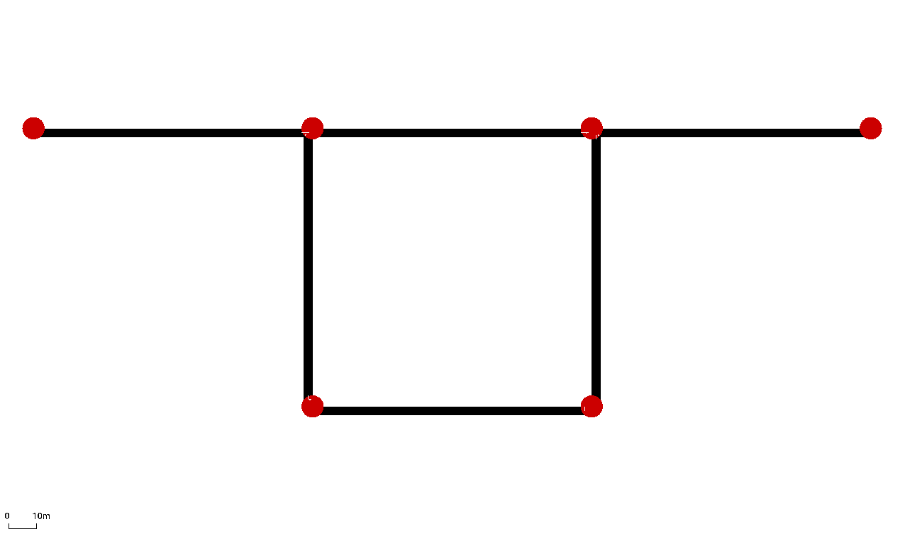

# **Introduction to Our Multi-Agent PettingZoo Framework and Its Functionalities**  

## Overview  

In this tutorial we introduce the [**TrafficEnvironment**](https://github.com/COeXISTENCE-PROJECT/RouteRL/blob/main/routerl/environment/environment.py) class, a [**PettingZoo**](https://pettingzoo.farama.org/index.html) AEC API environment, that implements the route decision-making of agents/vehicles navigating in different road networks. The environment supports two kind of agents: 
- Human drivers, that are simulated using human route-choice behavior from transportation research.
- Automated vehicles, are the RL agents that aim to optimize their routes and learn the most efficient paths.

The **TrafficEnvironment** class interacts with [**SUMO**](https://eclipse.dev/sumo/), an open-source, high-fidelity traffic simulator.  

  
  

  

## **Experimental Setup**  

In these notebooks, we utilize a two-route network within **SUMO**, where autonomous agents (vehicles) navigate from their predefined origins to their predefined destinations. The goal of each agent is to determine the fastest route dynamically.  

Users can customize parameters for the `TrafficEnvironment` class by consulting the [`routerl/environment/params.json`](https://github.com/COeXISTENCE-PROJECT/RouteRL/blob/4f4bc0a90d821e95b7193b00c93d6aaf10b34f41/routerl/environment/params.json) file. Based on its contents, they can create a dictionary with their preferred settings and pass it as an argument to the `TrafficEnvironment` class.

  

  

## **Related Work**  

Several studies have applied **Multi-Agent Reinforcement Learning (MARL)** for optimal route choice:  

- **Thomasini et al. (2023)** ([paper](https://alaworkshop2023.github.io/papers/ALA2023_paper_69.pdf)) leverage MARL for route optimization in macroscopic traffic simulations. These approaches model relationships between traffic flow characteristics such as density, flow, and mean speed. In contrast, our work employs a **microscopic model**, focusing on interactions between individual vehicles.  

- **Tavares and Bazzan (2012)** ([paper](https://www.researchgate.net/publication/235219033_Reinforcement_learning_for_route_choice_in_an_abstract_traffic_scenario)) introduce an MARL-based method for optimal route choice at the **microscopic level**, where rewards are generated using a predefined function. Our approach differs by dynamically generating rewards using a **continuous traffic simulator**, allowing for more adaptive and realistic agent behavior.  

---
