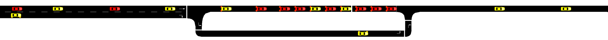
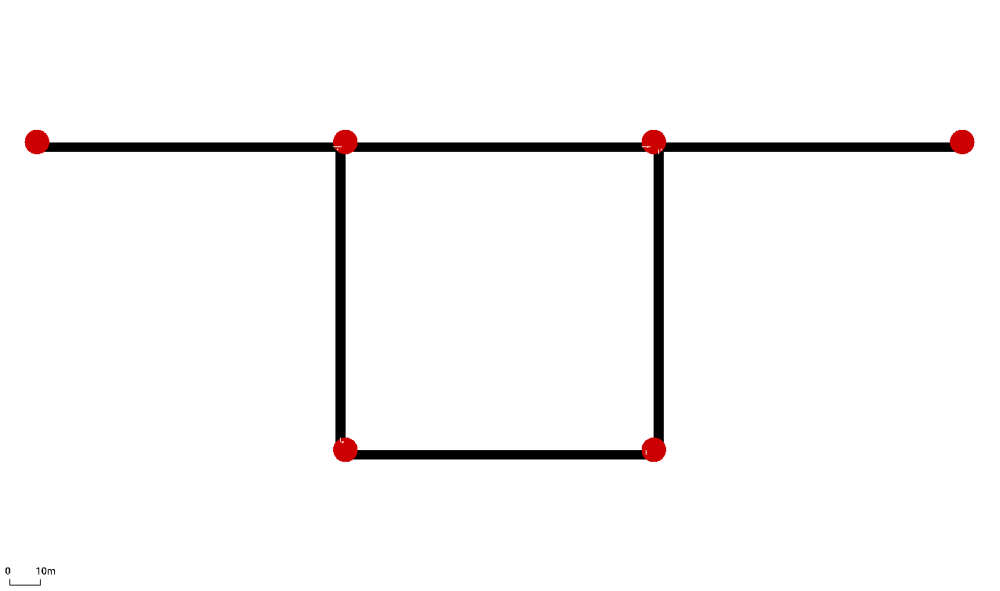

# **Introduction to Our Multi-Agent PettingZoo Framework and Its Functionalities**  

## Overview  

In this tutorial, we introduce the [**TrafficEnvironment**](https://github.com/COeXISTENCE-PROJECT/RouteRL/blob/main/routerl/environment/environment.py) class, a [**PettingZoo**](https://pettingzoo.farama.org/index.html) AEC API environment that models route decisions by vehicles navigating road networks. The environment supports two kinds of agents:

- Human drivers, simulated using human route-choice behavior from transportation research.
- Automated vehicles, modeled as RL agents that optimize their routes and learn the most efficient paths.

The **TrafficEnvironment** class interacts with [**SUMO**](https://eclipse.dev/sumo/), an open-source, high-fidelity traffic simulator.  

  
  

  

## **Experimental Setup**  

In this notebook, we use a two-route network in **SUMO**, where vehicles navigate from predefined origins to destinations. Each agent's goal is to select the fastest route dynamically.

Users can customize `TrafficEnvironment` by consulting its current [`defaults.json`](https://github.com/COeXISTENCE-PROJECT/RouteRL/blob/main/routerl/environment/defaults.json), overriding the desired values in a dictionary, and passing that dictionary to the class.

  

  

## **Related Work**  

Several studies have applied **Multi-Agent Reinforcement Learning (MARL)** for optimal route choice:  

- **Thomasini et al. (2023)** ([paper](https://alaworkshop2023.github.io/papers/ALA2023_paper_69.pdf)) leverage MARL for route optimization in macroscopic traffic simulations. These approaches model relationships between traffic flow characteristics such as density, flow, and mean speed. In contrast, our work employs a **microscopic model**, focusing on interactions between individual vehicles.  

- **Tavares and Bazzan (2012)** ([paper](https://www.researchgate.net/publication/235219033_Reinforcement_learning_for_route_choice_in_an_abstract_traffic_scenario)) introduce an MARL-based method for optimal route choice at the **microscopic level**, where rewards are generated using a predefined function. Our approach differs by dynamically generating rewards using a **continuous traffic simulator**, allowing for more adaptive and realistic agent behavior.  

---
