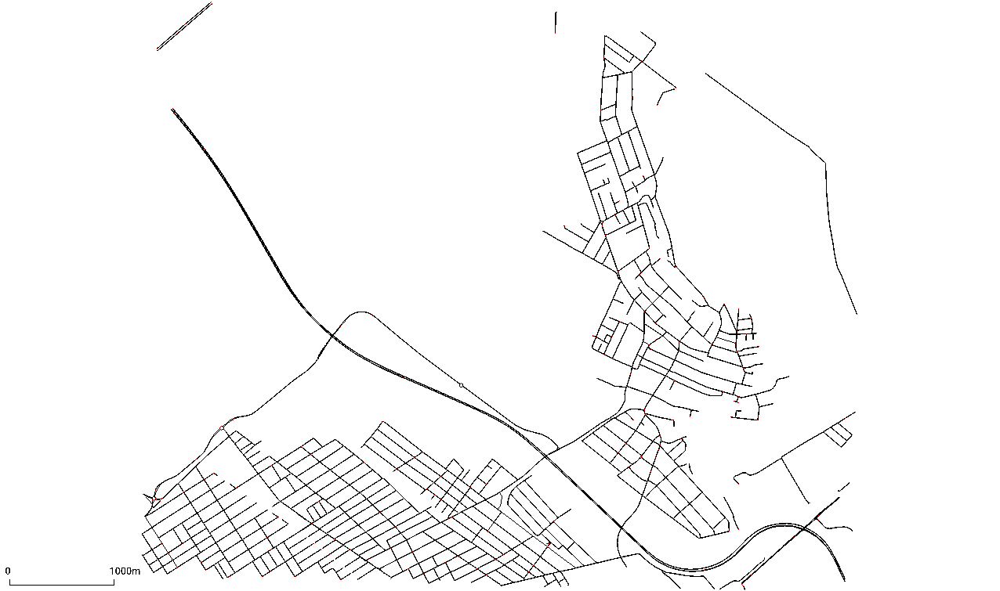

# Csomor Network: Experimenting with MARL Algorithms

> In this tutorial we use a medium sized-network for agents navigation. The chosen origin and destination points are specified in this [file](https://github.com/COeXISTENCE-PROJECT/RouteRL/blob/main/routerl/networks/default_ods.json), and  can be adjusted by users. In parallel, we the AV agent's learning process using different MARL algorithms provided by the [TorchRL](https://github.com/pytorch/rl) library.

---

## Network Overview

> In these notebooks, we utilize the **Csomor network** within our simulator, [SUMO](https://eclipse.dev/sumo/). This environment serves as a **flexible testbed** for experimenting with different MARL algorithms, allowing users to modify the **number of agents**, **number of paths**, and other key parameters.

### Included Tutorials:

This network supports all MARL algorithms implemented in the framework. Users can explore different training approaches and compare performance across various experimental settings.

- **[IQL Tutorial](https://github.com/COeXISTENCE-PROJECT/RouteRL/blob/main/tutorials/4_CsomorNetwork_DifferentMARLAlgorithms/iql_mutation.ipynb)**  
  Uses **Independent Q-Learning (IQL)** ([IQL](https://web.media.mit.edu/~cynthiab/Readings/tan-MAS-reinfLearn.pdf)).

- **[IPPO/MAPPO Tutorial](https://github.com/COeXISTENCE-PROJECT/RouteRL/blob/main/tutorials/4_CsomorNetwork_DifferentMARLAlgorithms/mappo_ippo_mutation.ipynb)**  
  Implements **Independent Proximal Policy Optimization (IPPO)** ([IPPO](https://arxiv.org/pdf/2011.09533)) and **Multi-Agent Proximal Policy Optimization** ([MAPPO](https://arxiv.org/abs/2103.01955)).

- **[ISAC/MASAC Tutorial](https://github.com/COeXISTENCE-PROJECT/RouteRL/blob/main/tutorials/4_CsomorNetwork_DifferentMARLAlgorithms/sac_mutation.ipynb)**  
  Uses **Independent SAC (ISAC)**, an entropy-regularized algorithm based on **Soft Actor-Critic (SAC)** ([SAC](https://arxiv.org/abs/1801.01290)).

- **[VDN Tutorial](https://github.com/COeXISTENCE-PROJECT/RouteRL/blob/main/tutorials/4_CsomorNetwork_DifferentMARLAlgorithms/vdn_mutation.ipynb)**  
  Implements **Value Decomposition Networks (VDN)** ([VDN](https://arxiv.org/pdf/1706.05296)).

- **[QMIX Tutorial](https://github.com/COeXISTENCE-PROJECT/RouteRL/blob/main/tutorials/4_CsomorNetwork_DifferentMARLAlgorithms/qmix_mutation.ipynb)**  
  Uses **QMIX** ([QMIX](http://arxiv.org/abs/1803.11485)), which applies a mixing network with a monotonicity constraint.

---

### Csomor Network Visualization

  

---

## Experimentation with Parameters

Here users can experiment with different configurations:

- **Number of Agents:** Vary the number of autonomous vehicles (AVs) and human drivers.
- **Number of Paths:** Explore how increasing or decreasing route options affects traffic dynamics.
- **Agent Behavior:** Assign different behaviors (selfish, cooperative, malicious, etc.) to AVs.
- **Algorithm Comparison:** Evaluate the performance of different MARL strategies under various conditions.

Users can fine-tune these parameters within the provided notebooks to study the effects on agent coordination, traffic congestion, and overall efficiency.

