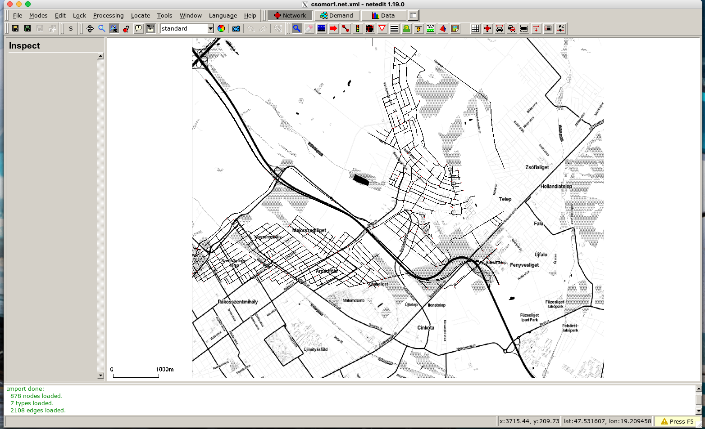
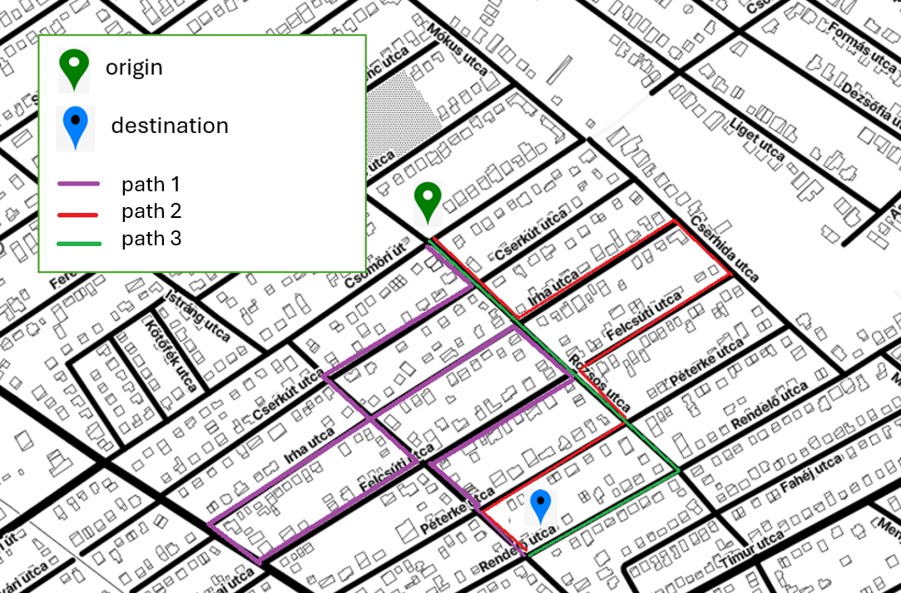

# Implementation of Multi-agent reinforcement learning algorithms on RouteRL framework

---

In these notebooks, we utilize the Csömör network in our simulator [SUMO](https://eclipse.dev/sumo/), where agents-vehicles will determine their route choices.



---

## Path Generation

Before running the notebooks we need to determine the paths that exist between destination and origin points, which can be adjusted by the user. In these notebooks, we defined 2 origin-destination pairs.
The following commands will generate the available paths:

```bash
cd path_generation
python3 generate_paths.py
```

Example of path generation:




--- 
## Number and type of agents

The number and type of agents in our experiments can be adjusted as needed. Agent information is provided in the `training_records/agents.csv` file.

